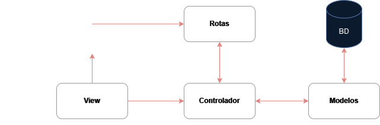

# ❗Importante: como rodar a aplicação -> <a href="./docs/start.md">AQUI</a> 

## Sobre a aplicação:
Esta aplicação é um CRUD simples utilizando o framework Laravel. As seguintes tecnologias foram utilizadas neste projeto:

| **Tecnologia** |
|:--------------:|
|       PHP      |
|     Laravel    |
|      Blade     |

## Diagrama de como a aplicação está estruturada:

    

