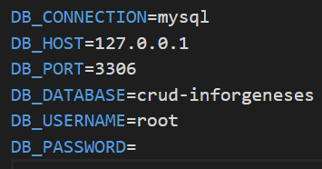

# ❗Pré-requisitos:
Como a aplicação faz uso do framework Laravel, verifique se os requisitos necessários para rodar a aplicação se fazem presentes na sua máquina. Cheque o requisitos aqui -> 
<a href="https://laravel.com/docs/5.0/installation">Instalação Laravel</a>

Basicamente você necessita das seguintes ferramentas:

| **Recurso** |
|:--------------:|
|       PHP      |
|     <a href="https://getcomposer.org">Composer</a>   |
| XAMPP(OPCIONAL)|

# ❗Configurando o projeto:
1. **Crie um novo banco de dados**: Crie um novo BD com um nome de sua escolha. A criação é necessária pois a aplicação necessita realizar a conexão com o mesmo para a seu funcionamento.
---
2. **Renomeie o arquivo *'.env.example'* para *'.env'***:
   - ❗❗ Ignore esse passo caso você já tenha um arquivo *'.env'* no diretório do projeto.
---
3. **Dentro do arquivo '.env' modifique os seguintes campos**:
   - DB_DATABASE = nome_do_db_que_voce_criou
   - DB_USERNAME=root (seu username de acesso ao bd)
   - DB_PASSWORD=blablabla (sua senha, se tiver)
        
   

        

        **figure 1** Exemplo de conf.
        

---
4. **Rode o comando dentro do diretório do projeto**: `composer install`
5. **Depois da instalação das dependências digite o comando**: `php artisan key:generate`
6. **Crie a tabela 'task' com o seguinte comando no terminal (IMPORTANTE: CERTIFIQUE-SE DE ESTAR NO DIRETÓRIO DO PROJETO)**: `php artisan migrate`
   - Se tudo estiver certo, uma tabela chamada 'task' estará criada no seu BD.
7. **Inicie o servidor usando o comando:** `php artisan serve`
   - Copie o link e jogue no seu browser.
---

# Opcional: Auto-popular o banco de dados:

Caso você queira gerar um conjunto de registros no BD basta você rodar o comando:
`php artisan db:seed`

**Aqui eu estou supondo que você seguiu e configurou o projeto de acordo com as instruções lá em cima.**